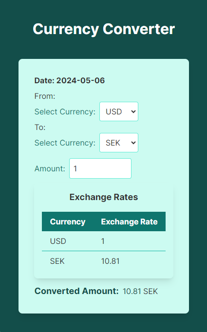

# Exchange_Express

Exchange_Express is a simple and efficient Currency Converter web application built using Next.js, TypeScript, and Tailwind CSS. It allows users to quickly convert between different currencies with real-time exchange rates.



## Features

-   **Easy Conversion:** Convert between various currencies effortlessly.
-   **Real-time Exchange Rates:** Fetches the latest exchange rates from a reliable API.
-   **Test Coverage:** Comprehensive test coverage with Jest ensures code reliability.

## Technologies Used

-   **Next.js:** A React framework for building server-side rendered and static web applications.
-   **TypeScript:** Adds static typing to JavaScript for improved code quality and developer productivity.
-   **Tailwind CSS:** A utility-first CSS framework for rapid UI development with minimal CSS code.
-   **Jest:** A delightful JavaScript testing framework for unit and integration testing.

## Installation

1. Clone the repository:

    ```bash
    git clone https://github.com/rubelweb/exchange_express.git
    ```

2. Navigate into the project directory:

    ```bash
    cd Exchange_Express
    ```

3. Install dependencies:

    ```bash
    npm install
    ```

## Usage

1. Start the development server:

    ```bash
    npm run dev
    ```

2. Open your browser and visit [http://localhost:3000](http://localhost:3000).

3. Enter the amount to convert, select the source and target currencies, and click "Convert".

## Testing

## Testing Configuration

To configure Jest to support JSX syntax, make sure to update the `"jsx"` property in your `tsconfig.json` file as follows:

````json
{
  "compilerOptions": {
    "jsx": "react"
  }
}

Run the test:

    ```bash
    npm test
````

## Credits

-   Exchange rates provided by [https://api.exchangerate-api.com].

## Deploy on Vercel

The easiest way to deploy your Next.js app is to use the [Vercel Platform](https://vercel.com/new?utm_medium=default-template&filter=next.js&utm_source=create-next-app&utm_campaign=create-next-app-readme) from the creators of Next.js.

Check out our [Next.js deployment documentation](https://nextjs.org/docs/deployment) for more details.
